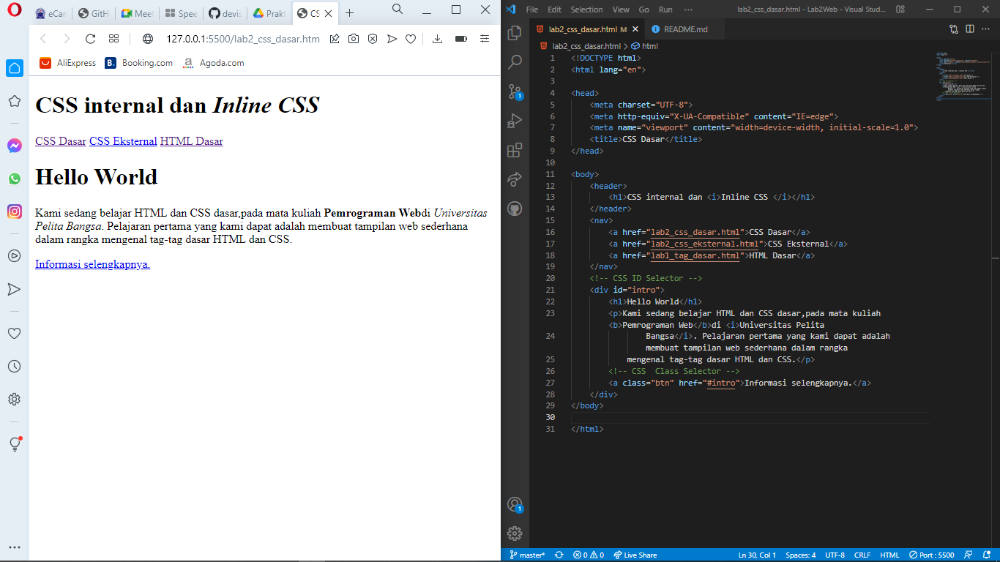
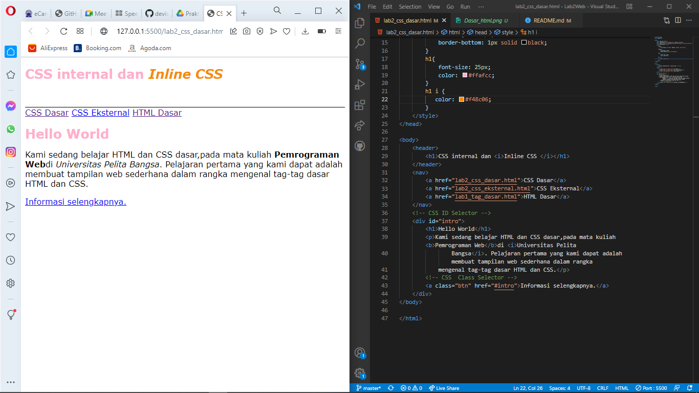
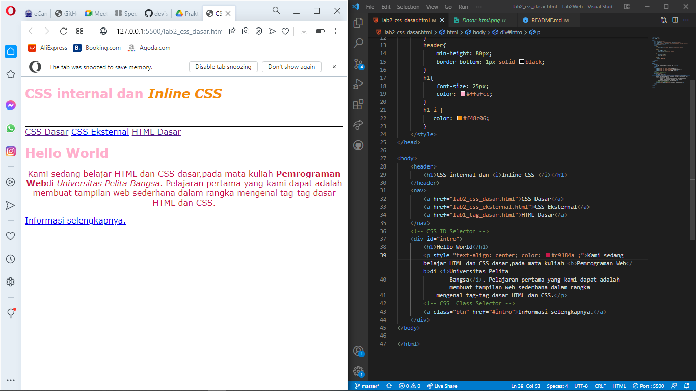

| DEVI SILMA        |  312010458    |
| -------------     | ------------- |
| PEMROGRAMAN       |   TI.20.A.2   |

# LAB2WEB 
### PERTEMUAN 3

Mata kuliah kali ini kita sedang belajar HTML dan CSS dasar seperi CSS Inline Internal dan Eksternal serta ID dan Class

## 1.) Langkah pertamaa buat dokumen HTML
### Contoh code beserta hasil nya


disini adalah contoh terdapat file dokumen html dasar yang belum diberi CSS dasar internal inline eksternal.
## Source Code
```html
<!DOCTYPE html>
<html lang="en">

<head>
    <meta charset="UTF-8">
    <meta http-equiv="X-UA-Compatible" content="IE=edge">
    <meta name="viewport" content="width=device-width, initial-scale=1.0">
    <title>CSS Dasar</title>
</head>

<body>
    <header>
        <h1>CSS internal dan <i>Inline CSS </i></h1>
    </header>
    <nav>
        <a href="lab2_css_dasar.html">CSS Dasar</a>
        <a href="lab2_css_eksternal.html">CSS Eksternal</a>
        <a href="lab1_tag_dasar.html">HTML Dasar</a>
    </nav>
    <!-- CSS ID Selector -->
    <div id="intro">
        <h1>Hello World</h1>
        <p>Kami sedang belajar HTML dan CSS dasar,pada mata kuliah <b>Pemrograman Web</b>di <i>Universitas Pelita
                Bangsa</i>. Pelajaran pertama yang kami dapat adalah membuat tampilan web sederhana dalam rangka
            mengenal tag-tag dasar HTML dan CSS.</p>
        <!-- CSS  Class Selector -->
        <a class="btn" href="#intro">Informasi selengkapnya.</a>
    </div>
</body>

</html>
```
## 2.) MENDEKLARASIKAN CSS INTERNAL
### Contoh code dan hasil nya


ini adalah contoh bagaimana menaruh inline dalam CSS dan juga code code dalam css nya seperti color pada h1 

## CODE

```css
<style>
        body{
            font-family: Verdana, Geneva, Tahoma, sans-serif;
        }
        header{
            min-height: 80px;
            border-bottom: 1px solid black;
        }
        h1{
            font-size: 25px;
            color: #ffafcc;
        }
        h1 i {
           color: #f48c06; 
        }
    </style>
```
## 3.) MENAMBAHKAN INLINE CSS
### contoh code dan hasil nya serta penempatan css inline nya


ini adalah contoh CSS inline,css inline adlah prioritas dalam pendeklarasian jika di deklarasikan secara bersamaan Inline prioritas

### Contoh Code
```html
<!-- INLINE CSS (p) -->
        <p style="text-align: center; color: #c9184a ;">Kami sedang belajar HTML dan CSS dasar,pada mata kuliah <b>Pemrograman Web</b>di <i>Universitas Pelita
                Bangsa</i>. Pelajaran pertama yang kami dapat adalah membuat tampilan web sederhana dalam rangka
            mengenal tag-tag dasar HTML dan CSS.</p>

```


