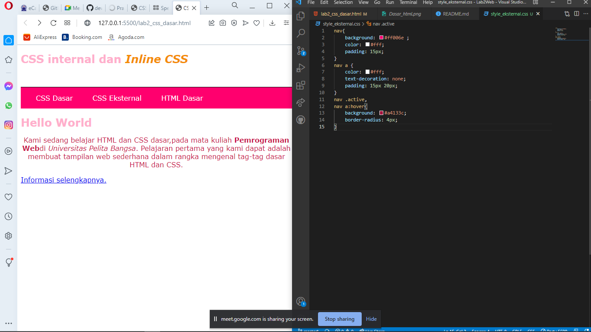
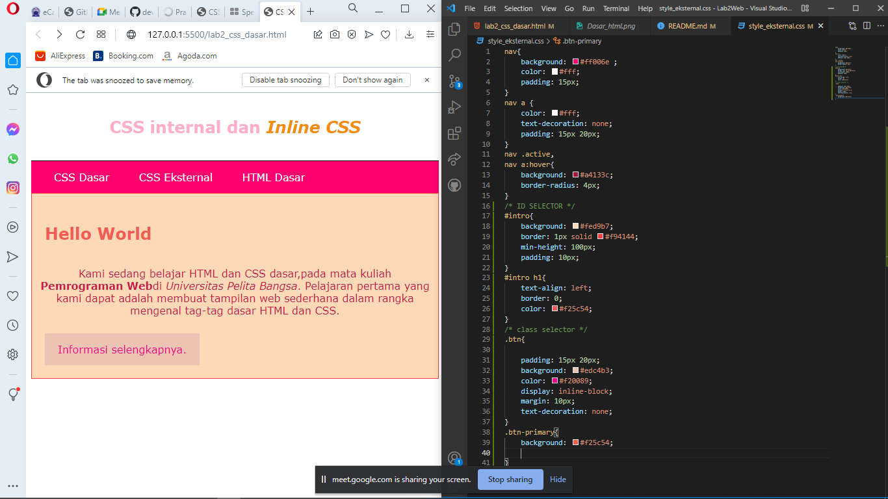
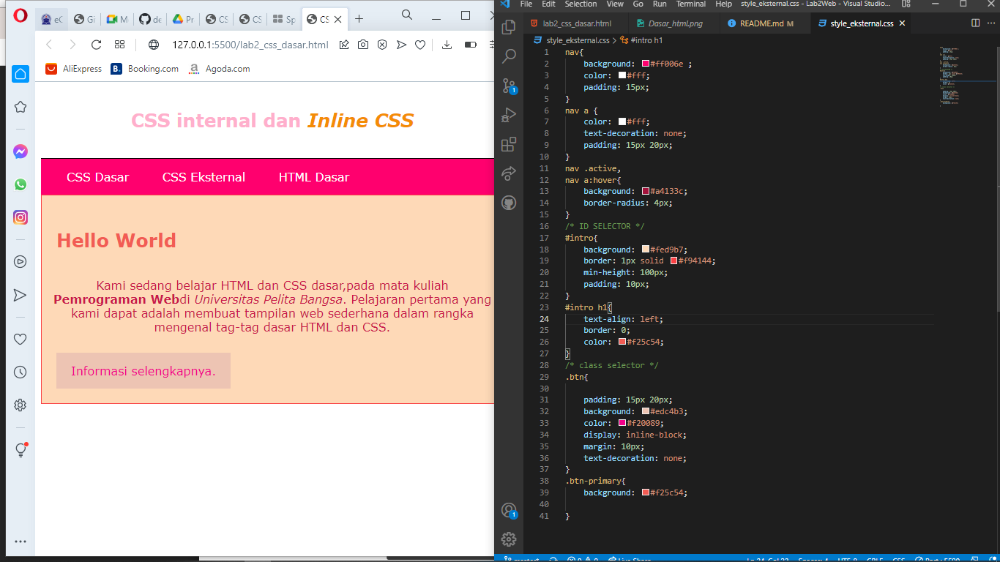
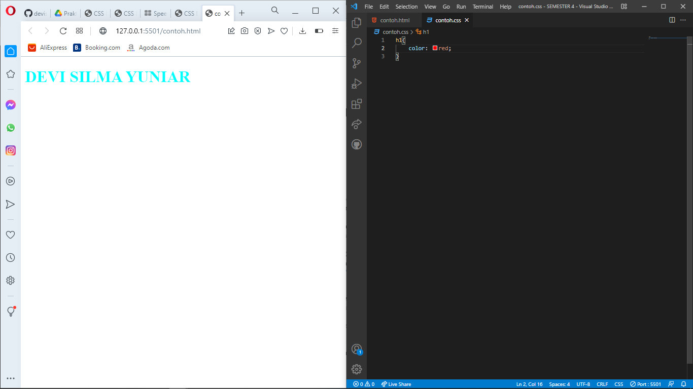

| DEVI SILMA        |  312010458    |
| -------------     | ------------- |
| PEMROGRAMAN       |   TI.20.A.2   |

# LAB2WEB 
### PERTEMUAN 3

Mata kuliah kali ini kita sedang belajar HTML dan CSS dasar seperi CSS Inline Internal dan Eksternal serta ID dan Class

## 1.) Langkah pertamaa buat dokumen HTML
### Contoh code beserta hasil nya


disini adalah contoh terdapat file dokumen html dasar yang belum diberi CSS dasar internal inline eksternal.
## Source Code
```html
<!DOCTYPE html>
<html lang="en">

<head>
    <meta charset="UTF-8">
    <meta http-equiv="X-UA-Compatible" content="IE=edge">
    <meta name="viewport" content="width=device-width, initial-scale=1.0">
    <title>CSS Dasar</title>
</head>

<body>
    <header>
        <h1>CSS internal dan <i>Inline CSS </i></h1>
    </header>
    <nav>
        <a href="lab2_css_dasar.html">CSS Dasar</a>
        <a href="lab2_css_eksternal.html">CSS Eksternal</a>
        <a href="lab1_tag_dasar.html">HTML Dasar</a>
    </nav>
    <!-- CSS ID Selector -->
    <div id="intro">
        <h1>Hello World</h1>
        <p>Kami sedang belajar HTML dan CSS dasar,pada mata kuliah <b>Pemrograman Web</b>di <i>Universitas Pelita
                Bangsa</i>. Pelajaran pertama yang kami dapat adalah membuat tampilan web sederhana dalam rangka
            mengenal tag-tag dasar HTML dan CSS.</p>
        <!-- CSS  Class Selector -->
        <a class="btn" href="#intro">Informasi selengkapnya.</a>
    </div>
</body>

</html>
```
## 2.) MENDEKLARASIKAN CSS INTERNAL
### Contoh code dan hasil nya


ini adalah contoh bagaimana menaruh inline dalam CSS dan juga code code dalam css nya seperti color pada h1 

## CODE

```css
<style>
        body{
            font-family: Verdana, Geneva, Tahoma, sans-serif;
        }
        header{
            min-height: 80px;
            border-bottom: 1px solid black;
        }
        h1{
            font-size: 25px;
            color: #ffafcc;
        }
        h1 i {
           color: #f48c06; 
        }
    </style>
```
## 3.) MENAMBAHKAN INLINE CSS
### contoh code dan hasil nya serta penempatan css inline nya


ini adalah contoh CSS inline,css inline adlah prioritas dalam pendeklarasian jika di deklarasikan secara bersamaan Inline prioritas

### Contoh Code
```html
<!-- INLINE CSS (p) -->
        <p style="text-align: center; color: #c9184a ;">Kami sedang belajar HTML dan CSS dasar,pada mata kuliah <b>Pemrograman Web</b>di <i>Universitas Pelita
                Bangsa</i>. Pelajaran pertama yang kami dapat adalah membuat tampilan web sederhana dalam rangka
            mengenal tag-tag dasar HTML dan CSS.</p>

```

## 4). MEMBUAT CSS EKSTERNAL
### CONTOH CODE DAN HASILNYA


css eksternal adalah css yang dimana filenya terpisah dengan html itu sendiri dengan melalui link penempatan css, css eksternal mampu digunakan banyak file html itulah keunggulan dari ccs eksternal

## CODE
```css 
nav{
    background: #ff006e ; 
    color: #fff;
    padding: 15px;
}
nav a {
    color: #fff;
    text-decoration: none;
    padding: 15px 20px;
}
nav .active,
nav a:hover{
    background: #a4133c;
    border-radius: 4px;
}
```
## 5). MENAMBAHKAN CSS SELECTOR
### CONTOH CODE DAN HASILNYA


css selector adalah pemilihan dengan menggunakan id atau class dan bisa juga selector pada tag dan element html id menggunakan code yang dimana didalam file css menggunakan (#) sedangkan class menggunakan code yang ketika di css pendeklarasiannya yaitu (.) sedangkan selector element atau tag pendeklarasiannya (p) atau element lainnya

## contoh code 
```css
/* ID SELECTOR */
#intro{
    background: #fed9b7;
    border: 1px solid #f94144;
    min-height: 100px;
    padding: 10px;
}
#intro h1{
    text-align: left;
    border: 0;
    color: #f25c54;
}
/* class selector */
.btn{

    padding: 15px 20px;
    background: #edc4b3;
    color: #f20089;
    display: inline-block;
    margin: 10px;
    text-decoration: none;
}
.btn-primary{
    background: #f25c54;
    
}
```


## PERTANYAAN DAN TUGAS

## 1). Lakukan eksperimen dengan mengubah dan menambah properti dan nilai pada kode CSS dengan mengacu pada CSS Cheat Sheet yang diberikan pada file terpisah dari modul ini.

---------------------------------------------------------------------------------------------------------------------------

**JAWABAN**



disitu saya menambahkan hover pada nav a agar ketika cursor mengarah akan terdapat warna yang berbeda dan saya juga menambahkan border radius 4px agar terlihat lebih menarik.

```css
nav .active,
nav a:hover{
    background: #a4133c;
    border-radius: 4px;
}
``` 

## 2). Apa perbedaan pendeklarasian CSS elemen h1 {...} dengan #intro h1 {...}? berikan penjelasannya!

------------------------------------------------------------------------------

**JAWABAN**

jadi jika hanya css element h1 saja berarti pendeklarasian h1 akan diberi gaya semua pada css sedangkan jika #intro h1 hanya pada #intro h1 saja yang akan diberi gaya pada css karena itu adalah ID yang bersifat unik hanya file atau element yang terdapat ID saja yang akan dideklasikan di css.

## 3). Apabila ada deklarasi CSS secara internal, lalu ditambahkan CSS eksternal dan inline CSS pada elemen yang sama. Deklarasi manakah yang akan ditampilkan pada browser? Berikan penjelasan dan contohnya!

-----------------------------------------------------------------------------

**JAWABAN**

ketika kita mendeklarasikan secara bersamaaan antara internal, eksternal, dan inline yang tepanggil dibrowser adalah inline, disitu saya memiliki deklarasi dengan properti color, di internal color yang saya gunakan berwarna orange sementara di inline berwarna aqua, dan di eksternal berwarna red namun yang terpanggil yaitu inline dengan warna aqua karena inline memiliki proritas tertinggi. 

.png)
**diatas adalah deklarasi inline dan internal sementara foto dibawah deklarasi eksternal**
.

jadi yang terpanggil adalah css inline


